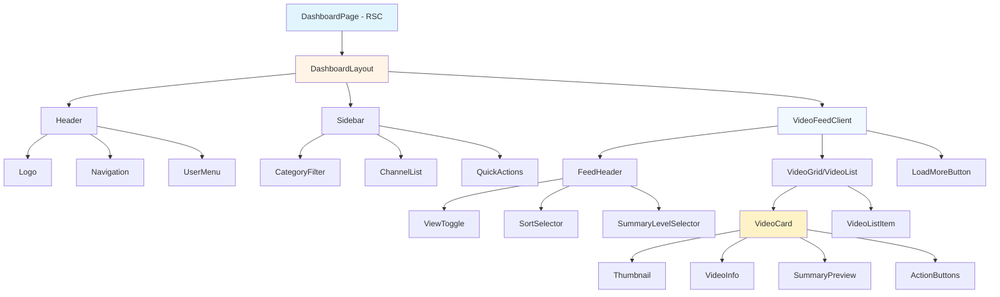
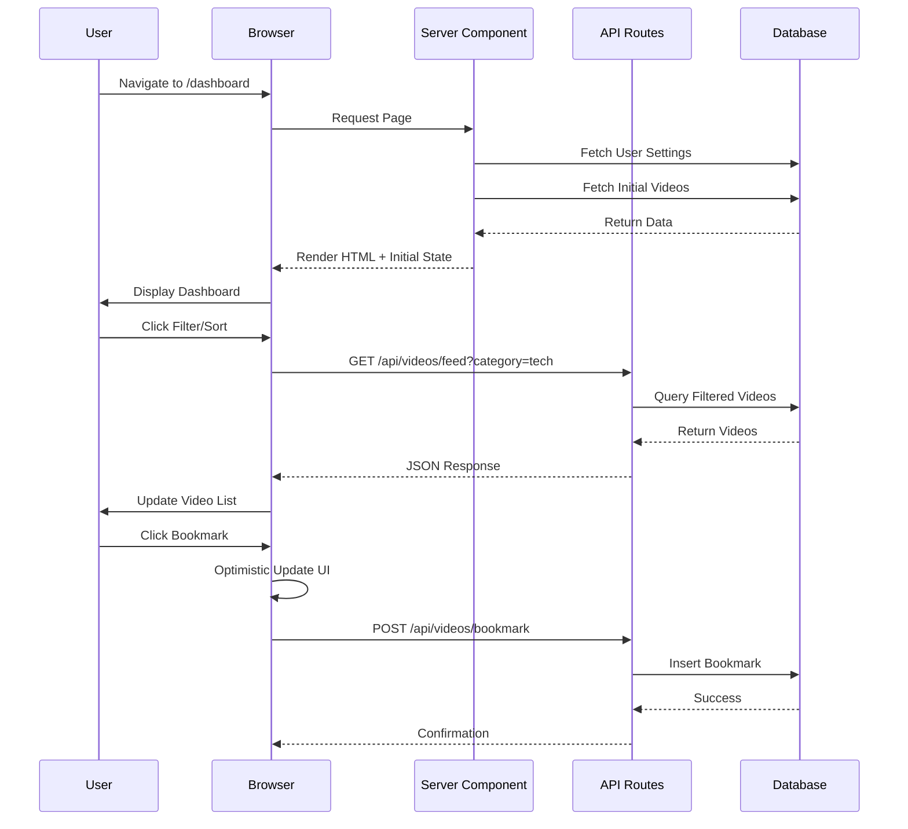
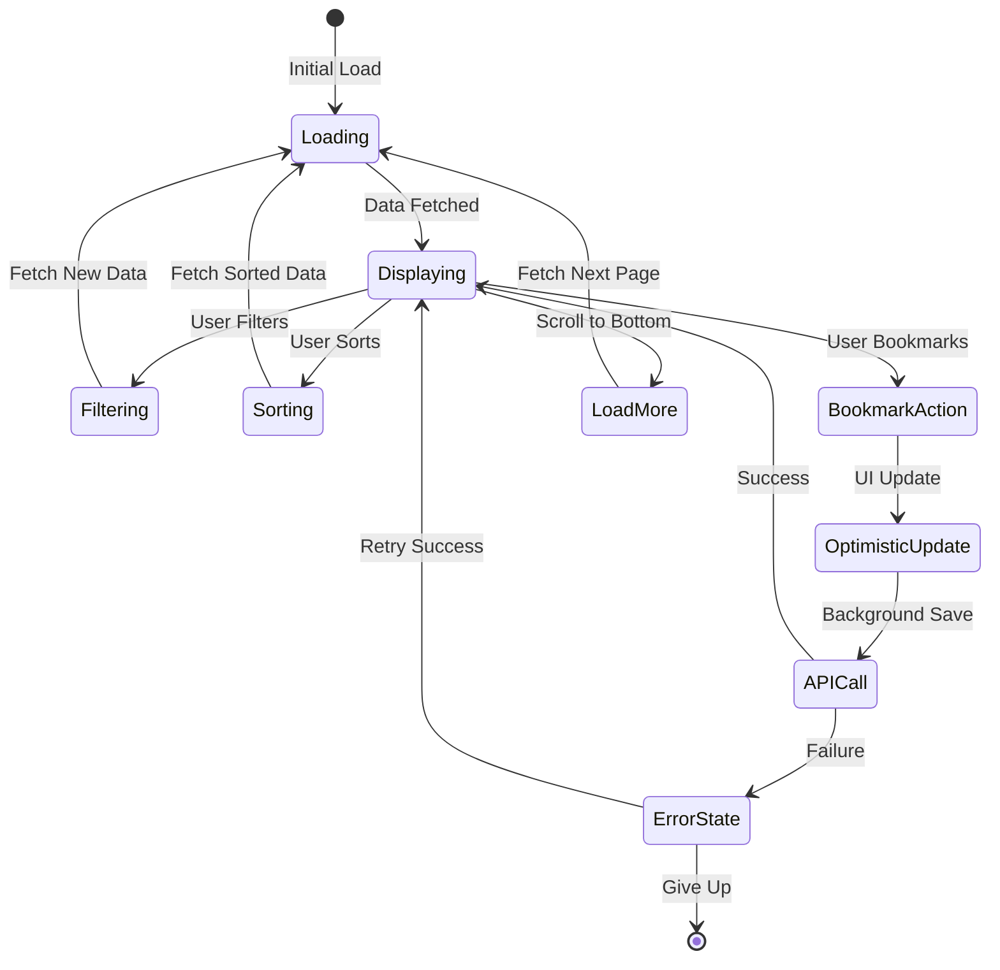
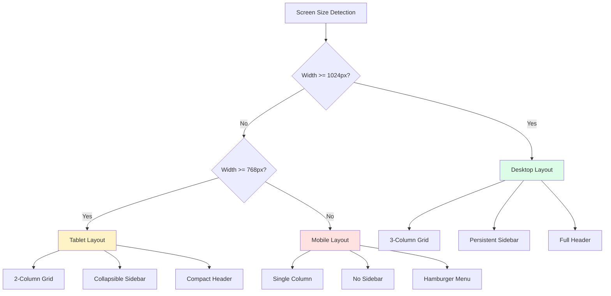
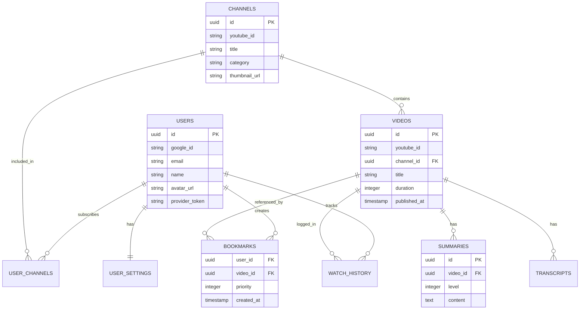
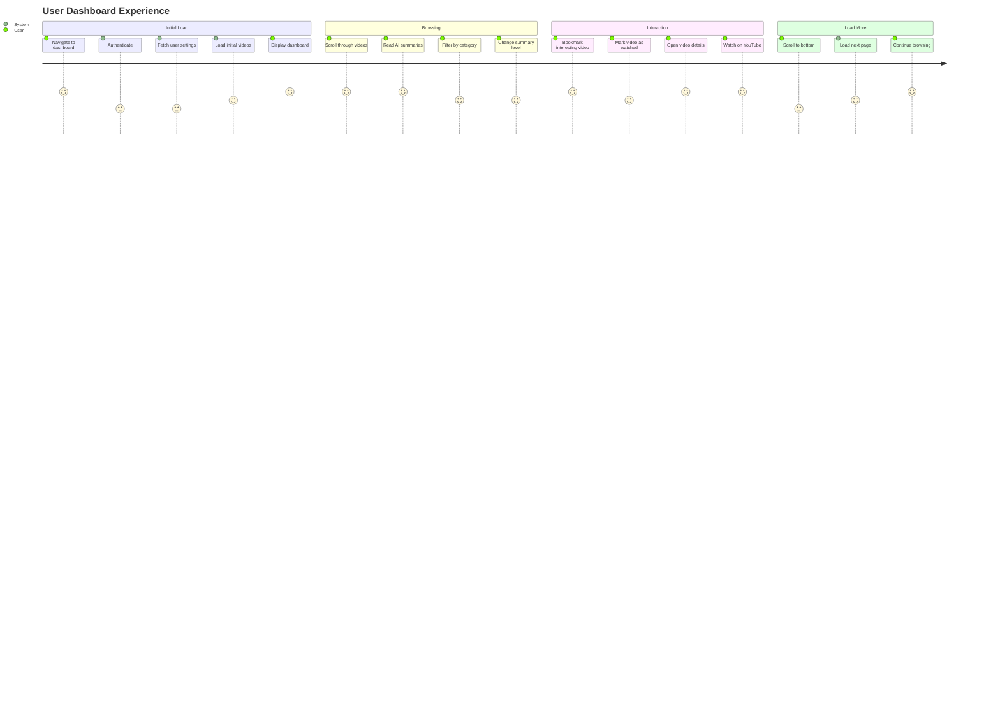
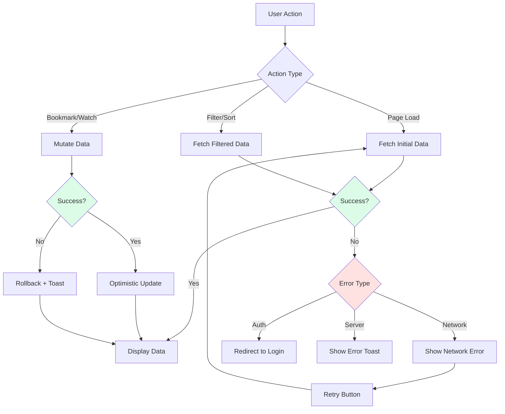
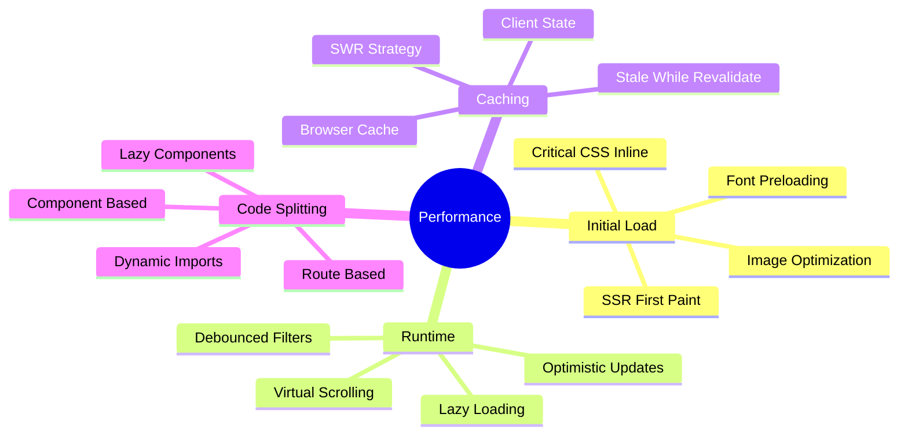

# TubeBrew Dashboard Architecture

## Component Architecture Diagram



## Data Flow Diagram



## State Management Flow



## API Architecture

```mermaid
graph LR
    A[Client] --> B{API Gateway}
    B --> C[/api/videos/feed]
    B --> D[/api/videos/bookmark]
    B --> E[/api/videos/watch]
    B --> F[/api/videos/:id]

    C --> G[DBUtils.getRecentVideos]
    D --> H[DBUtils.addBookmark]
    D --> I[DBUtils.removeBookmark]
    E --> J[DBUtils.markAsWatched]
    F --> K[DBUtils.getVideoWithSummaries]

    G --> L[(Supabase)]
    H --> L
    I --> L
    J --> L
    K --> L

    style B fill:#e0f2fe
    style L fill:#dcfce7
```

## Responsive Layout Flow



## Database Schema Relations



## Component Props Flow

```mermaid
graph TD
    A[DashboardPage Props] --> B[initialVideos]
    A --> C[userSettings]

    B --> D[VideoFeedClient]
    C --> D

    D --> E[videos: DashboardVideo[]]
    D --> F[filters: FilterState]
    D --> G[preferences: UserPreferences]

    E --> H[VideoCard]
    F --> I[FeedHeader]
    G --> I

    H --> H1[video: DashboardVideo]
    H --> H2[onBookmark: Function]
    H --> H3[onWatch: Function]
    H --> H4[summaryLevel: SummaryLevel]

    I --> I1[sortBy: string]
    I --> I2[viewMode: string]
    I --> I3[summaryLevel: number]

    style A fill:#dbeafe
    style D fill:#fef3c7
    style H fill:#dcfce7
```

## User Interaction Flow



## Error Handling Flow



## Performance Optimization Strategy



---

## Implementation Priority Matrix

| Component | Priority | Complexity | Dependencies |
|-----------|----------|------------|--------------|
| DashboardLayout | P0 | Low | None |
| Header | P0 | Low | UserMenu |
| VideoCard | P0 | Medium | None |
| VideoFeedClient | P0 | High | VideoCard, API |
| API /videos/feed | P0 | Medium | DBUtils |
| CategoryFilter | P1 | Low | None |
| FeedHeader | P1 | Medium | None |
| VideoDetailModal | P1 | Medium | VideoCard |
| API /videos/bookmark | P1 | Low | DBUtils |
| API /videos/watch | P1 | Low | DBUtils |
| Sidebar | P2 | Medium | CategoryFilter |
| LoadMore/Pagination | P2 | Medium | VideoFeedClient |

---

## Technology Stack

```
Frontend:
├── Framework: Next.js 15 (App Router)
├── UI: React 19
├── Styling: Tailwind CSS
├── Components: Radix UI primitives
├── State: React useState, useOptimistic
└── Type Safety: TypeScript

Backend:
├── API: Next.js API Routes
├── Database: Supabase (PostgreSQL)
├── ORM: Supabase Client
├── Auth: Supabase Auth
└── Utilities: @tubebrew/db

Infrastructure:
├── Hosting: Vercel
├── CDN: Vercel Edge Network
├── Database: Supabase Cloud
└── Monitoring: (TBD - Sentry?)
```
